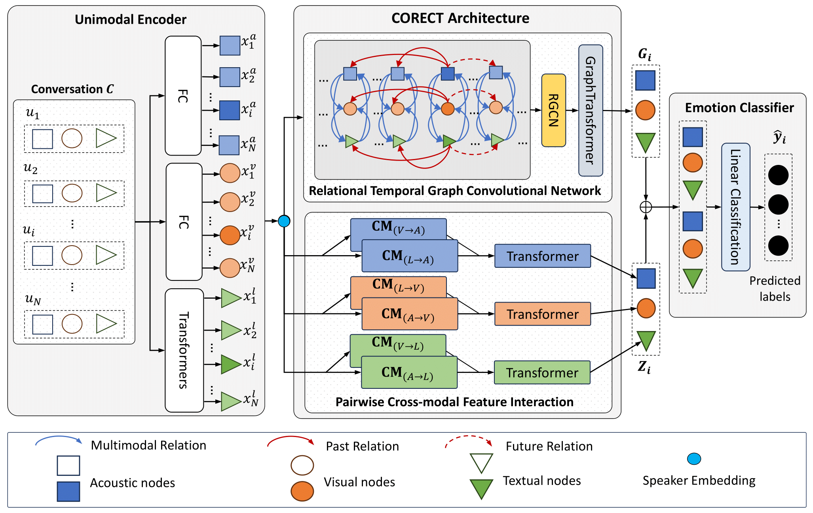

# CORECT
Paper: [Conversation Understanding using Relational Temporal Graph Neural Networks with Auxiliary Cross-Modality Interaction](https://aclanthology.org/2023.emnlp-main.937/)

Abstract:

Emotion recognition is a crucial task for human conversation understanding. It becomes more challenging with the notion of multimodal data, e.g., language, voice, and facial expressions. As a typical solution, the global- and the local context information are exploited to predict the emotional label for every single sentence, i.e., utterance, in the dialogue. Specifically, the global representation could be captured via modeling of cross-modal interactions at the conversation level. The local one is often inferred using the temporal information of speakers or emotional shifts, which neglects vital factors at the utterance level. Additionally, most existing approaches take fused features of multiple modalities in an unified input without leveraging modality-specific representations. Motivating from these problems, we propose the Relational Temporal Graph Neural Network with Auxiliary Cross-Modality Interaction (CORECT), an novel neural network framework that effectively captures the cross-modality interaction and temporal dependencies in the modality-specific manner for conversation understanding. Extensive experiments demonstrate the effectiveness of CORECT via its state-of-the-art results on the IEMOCAP and CMU-MOSEI datasets for the multimodal ERC task.

Architecture:

## Requirements
```
python==3.11.3
torch==2.0.1
torch-geometric==2.3.1
sentence-transformers==2.2.2
comet-ml==3.33.4
```
### Installation
- [PyTorch Geometric](https://pytorch-geometric.readthedocs.io/en/latest/notes/installation.html)
- [Comet.ml](https://www.comet.ml/docs/python-sdk/advanced/)
- [Sentence Transformer](https://www.sbert.net/)
### Preparing datasets
```
bash run_preprocess.sh
```
### Training
```
bash run_train.sh
```
### Evaluate
```
bash run_eval.sh
```
### Citation
```
@inproceedings{nguyen-etal-2023-conversation,
    title = "Conversation Understanding using Relational Temporal Graph Neural Networks with Auxiliary Cross-Modality Interaction",
    author = "Nguyen, Cam Van Thi  and
      Mai, Tuan  and
      The, Son  and
      Kieu, Dang  and
      Le, Duc-Trong",
    booktitle = "Proceedings of the 2023 Conference on Empirical Methods in Natural Language Processing",
    publisher = "Association for Computational Linguistics",
    year = "2023",
    url = "https://aclanthology.org/2023.emnlp-main.937",
    doi = "10.18653/v1/2023.emnlp-main.937",
    pages = "15154--15167",
}

```
